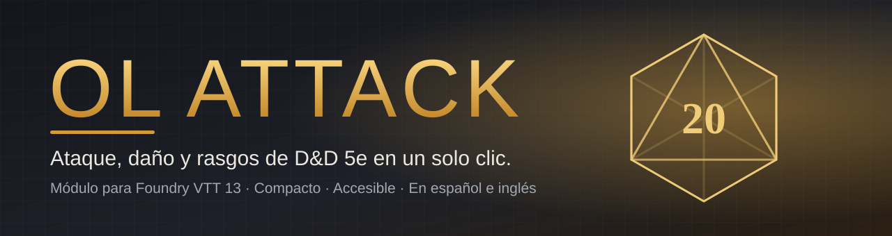
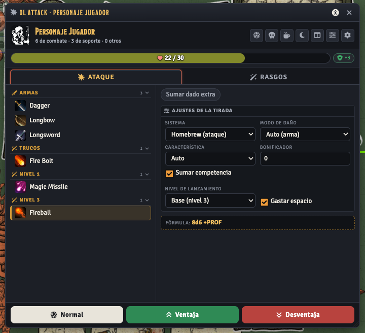
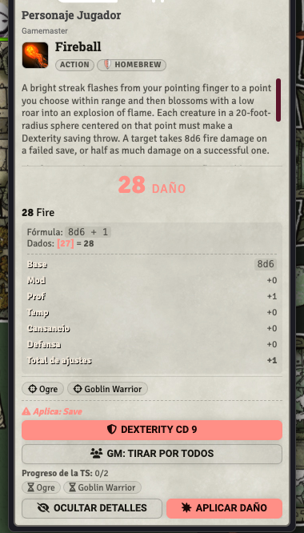
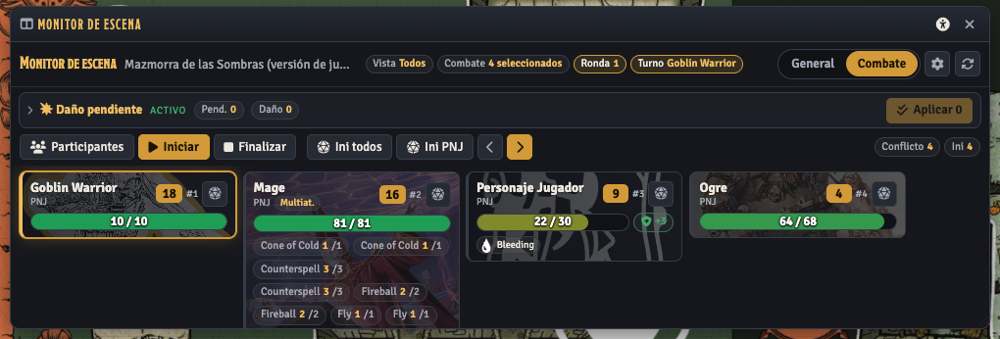

<p align="center">
  
</p>

<p align="center">
  <a href="https://github.com/ManuRomera/ol-attack/releases/latest"></a>
  <a href="https://foundryvtt.com"></a>
  <a href="https://github.com/ManuRomera/ol-attack/releases"></a>
  
</p>

<p align="center"><b>Menos clics, más mesa.</b><br>
Elige el arma o el hechizo, pulsa <i>Normal · Ventaja · Desventaja</i> y deja que OL Attack haga el resto:<br>
tirada, tarjeta de chat, salvaciones, resistencias, daño aplicado y seguimiento de todo el combate.</p>

---

## ¿Qué es?

**OL Attack** es un módulo para **Foundry VTT** que reemplaza el engorroso reparto de diálogos de D&D 5e por **una sola ventana compacta** con todo lo que usas en combate: armas, hechizos, rasgos, recursos y vida. Pensado para mesas que quieren **agilidad**: la persona que juega tira en segundos y el máster controla el combate de un vistazo.

<p align="center">
  
  &nbsp;
  
</p>

## ✨ Lo que te da

| | |
|---|---|
| ⚔️ **Todo en una ventana** | Armas, hechizos y rasgos agrupados y plegables. PG, PG temporales, espacios de conjuro, usos y concentración en una sola franja. Los botones de tirada están **siempre visibles**. |
| 💬 **Tarjetas de chat inteligentes** | Daño o curación con desglose plegable, objetivos, botón de **salvación** para cada criatura (cada jugador tira la suya) y **Aplicar daño** con previsualización de resistencias, vulnerabilidades e inmunidades. |
| 🧭 **Monitor de escena** | Panel del máster con la vida, estados, recursos e iniciativa de todas las fichas. Modo combate con turno activo, orden de iniciativa y un **libro de daño pendiente** para aplicar de golpe. |
| 👥 **Vista resumida para jugadores** | Los jugadores ven el combate sin ver lo que no deben: los PNJ ajenos no revelan sus datos. |
| 🔮 **Perfiles de acción con JSON** | Define cómo se comporta cualquier hechizo o rasgo —varias tiradas, elecciones, estados automáticos al fallar una salvación— sin depender del nombre del objeto. Importable y exportable. |
| 🛌 **Todo a mano** | Iniciativa, salvación de muerte, descansos corto y largo, estados, objetivos y mano débil, a un clic. |
| ♿ **Accesible de serie** | Icono en cada ventana para ajustar el tamaño del texto, alto contraste, fuente de alta legibilidad, reducir movimiento y ayuda inmediata. Navegación con teclado. |
| 🖼️ **Encuadre de retratos** | Elige qué zona y con qué zoom se ve cada retrato, igual en las ventanas, el directorio y el combate. |
| 💾 **Recuerda tu mesa** | Cada ventana guarda su posición, tamaño y secciones abiertas. |

## 🧭 El monitor de escena, de un vistazo

<p align="center">
  
</p>

## 🚀 Instalación

En Foundry: **Configuración → Módulos → Instalar módulo** y pega este manifest:

```text
https://github.com/ManuRomera/ol-attack/releases/latest/download/module.json
```

Actívalo en tu mundo de D&D 5e. Las actualizaciones llegan solas desde Foundry.

## 🎲 Cómo se usa

1. Abre OL Attack desde el **icono de la cabecera de la ficha**, el **HUD del token** o la **macro de la barra rápida** (`game.olAttack.open()`).
2. Elige un arma, hechizo o rasgo de la lista (↑ ↓ para recorrerla).
3. Pulsa **Normal**, **Ventaja** o **Desventaja** (o `Enter`, `Mayús+Enter`, `Alt+Enter` con el foco en la ventana).
4. En el chat, usa **Aplicar daño** o deja que cada jugador **tire su salvación**.
5. El máster abre el **monitor de escena** (icono de pantalla o macro 2) para llevar el combate.

> **Botón derecho** sobre la cabecera o sobre una ficha del monitor: marcar objetivo, aplicar o quitar estados.

## ⚙️ Compatibilidad

- **Foundry VTT** 13 (verificado en 13.351; preparado para 14).
- **D&D 5e** (sistema `dnd5e`) 5.3. Con un perfil de datos configurable también sirve para homebrew.
- Idiomas: español e inglés.

## 🔧 Notas técnicas

- Interfaz sobre **ApplicationV2 / DialogV2**. Sin dependencias externas.
- Las preferencias van en `flags.ol-attack` del actor; la posición de las ventanas, en el navegador.
- Comunicación jugador ↔ máster por el socket `module.ol-attack`.
- Informe de calidad y decisiones: [`docs/AUDITORIA.md`](docs/AUDITORIA.md) · Historial: [`CHANGELOG.md`](CHANGELOG.md).

## 🛠️ Para quien desarrolle

```bash
node scripts/check.mjs                      # manifiesto, idiomas y código
git tag v0.2.1 && git push origin v0.2.1    # publica la release (GitHub Actions)
```

---

<p align="center">Hecho con cariño por <a href="https://github.com/ManuRomera">Manu Romera</a> · Bruma's Rol</p>

---

<p align="center">
  <a href="https://github.com/ManuRomera">
    <picture>
      <source media="(prefers-color-scheme: dark)" srcset="https://raw.githubusercontent.com/ManuRomera/ManuRomera/main/brand/MR_09_Monograma_Marfil_Transparente.png">
      
    </picture>
  </a><br>
  <sub>Hecho por <a href="https://github.com/ManuRomera"><b>Manu Romera</b></a> · Digital RPG Design</sub>
</p>
